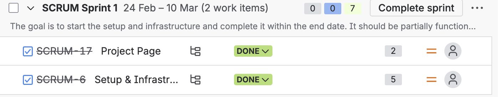

# Project Update

## 1. Product Backlog Delivered
I completed a total of 7 story points at the end of the first sprint. 
- **SCRUM-17: Project Page** - The main landing page is up and running.
- **SCRUM-6: Setup & Infrastructure** - The core development environment and repository are fully configured.

## 2. Product Burndown Chart
Here is the link to my updated burndown chart showing my starting backlog and the points remaining as I go into Sprint 2:
[Link to My Google Sheet Burndown Chart] https://docs.google.com/spreadsheets/d/1URmSCuPfr-Nlg_PJp2cDhSjLodlnln3Gsoeg_e0o6tw/edit?usp=sharing

## 3. Project Retrospective
**What went well:** Getting the basic infrastructure (SCRUM-6) and the Project Page (SCRUM-17) completed early gave me a lot of momentum. It feels great to have the foundation ready.
**What was hard:** Figuring out exactly how to map out the story points and break down the remaining 50 points in the backlog felt overwhelming at first. 
**Future Actions:** Moving into Sprint 2, I need to make sure I don't pull too many high-point items (like the 8-point Text Extraction) into a single sprint so I can maintain a steady burndown rate.
